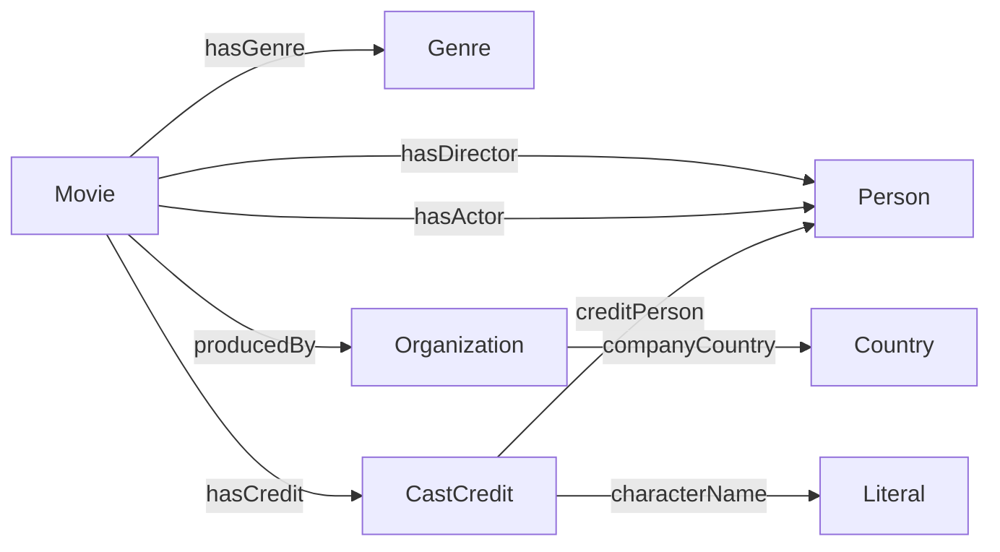

# Làm project Movie Linked Open Data từng bước

**Đích đến:** tự giải thích và chạy được chuỗi `nguồn dữ liệu → bảng chuẩn hóa → RDF → ontology/suy luận → liên kết ngoài → SPARQL → công bố dữ liệu`.

Hướng dẫn dựa trên đề trong `../../theory/20261-IT6390E.xlsx`, sheet **Capstone Project**, C4:C8 và D3; đối chiếu `QSTT - IT6390E - Capstone.xlsx`. File QSTT có ghi lựa chọn Education/phân công của một nhóm, không phải yêu cầu tất cả nhóm làm Education.

**Cập nhật triển khai:** đã chọn hai CSV **TMDB 5000 trên Kaggle** làm đầu vào và có `scripts/tmdb.py` để chuẩn bị 12 bảng CSV. Làm bước thực tế theo [DATA_PREPARATION.md](DATA_PREPARATION.md). Những lựa chọn nguồn và tên script trong lộ trình bên dưới là hướng dẫn tổng quát; với snapshot đã chọn, chưa có IMDb ID hoặc company country, nên cần điều chỉnh ontology và chính sách linking theo trường thật.

Các ngưỡng quy mô, số query và lịch làm dưới đây là **đề xuất**, không phải rubric điểm của thầy. Đạt chuẩn dữ liệu 5★ cũng không đồng nghĩa tự động đạt điểm tối đa môn học.

## 1. Chốt đúng yêu cầu và bằng chứng 5★

| Yêu cầu trong đề | Đầu ra của project movie |
|---|---|
| Define an ontology | `ontology/movie.ttl`, sơ đồ, giải thích class/property/axiom |
| Collect relevant data | Dữ liệu nguồn, snapshot, data dictionary |
| Transform into 4★ | RDF hợp lệ, URI công khai và tra cứu được |
| Link to other datasets for 5★ | Linkset đúng thực thể và truy vấn dùng liên kết |
| SPARQL endpoint/terminal | CLI thực thi SPARQL; thêm Fuseki để demo thuận tiện |
| Expected outcome | Slide, report ≤15 trang, video 3–5 phút |

Theo [5-star Open Data](https://5stardata.info/en/), các mức được tích lũy: có giấy phép mở và truy cập qua web; dữ liệu có cấu trúc; định dạng mở; URI định danh thực thể; liên kết dữ liệu bên ngoài. Trong môn này, thực hiện mức 4 bằng RDF/URI và mức 5 bằng liên kết sang KG khác.

| Mức | Bằng chứng cần đưa thầy xem |
|---|---|
| ★ | URL dữ liệu công khai, thông tin nguồn và giấy phép mở phù hợp |
| ★★ | Bảng có cột/kiểu dữ liệu, máy đọc được |
| ★★★ | CSV UTF-8 được công bố |
| ★★★★ | Turtle/JSON-LD, URI ổn định; mở URI lấy được mô tả hữu ích |
| ★★★★★ | RDF links sang thực thể bên ngoài, ví dụ `owl:sameAs`, kèm dữ liệu bổ sung lấy qua link |

Không cần tạo riêng một file Excel để “đi qua” mức 2. Dữ liệu CSV mở đáp ứng đồng thời phần cấu trúc của mức 2 và định dạng của mức 3. Một file `.ttl` chỉ trên máy local là mốc kỹ thuật, chưa đủ bằng chứng xuất bản 4★/5★.

OWL reasoning, giao diện đẹp và số lượng triple không tự tăng số sao. Ontology vẫn là yêu cầu riêng của đề. Tham khảo nguyên tắc URI có thể tra cứu tại [Linked Data — Tim Berners-Lee](https://www.w3.org/DesignIssues/LinkedData.html).

## 2. Chọn nguồn dữ liệu ngay từ đầu

Bạn mới chốt **movie domain**, chưa chỉ định dataset cụ thể. Có hai hướng thực tế:

| Hướng | Điểm mạnh | Việc phải giải quyết |
|---|---|---|
| TMDB → local KG → Wikidata/DBpedia | Sát repo mẫu; có credits, rating, genres | API key, snapshot, quyền phát hành lại dữ liệu |
| Wikidata facts → CSV → local ontology → DBpedia | Metadata có CC0, dễ giải thích tính mở | Chứng minh mapping/biến đổi thực sự và liên kết sang nguồn thứ hai |

**Khuyến nghị cho mục tiêu 5★ rõ ràng:** lấy metadata phim từ Wikidata làm tập dữ liệu phát hành, chuẩn hóa sang bảng, dùng local ontology và liên kết DBpedia. Quy trình CSV → RDF vẫn có giá trị học thuật nếu có mapping, làm sạch, modeling và provenance; cần nói rõ nguồn vốn đã là KG, không nhận là tự tạo tri thức mới. Nếu muốn sát mẫu hơn, chọn TMDB, nhưng chỉ khẳng định 5★ khi quyền phát hành tập dữ liệu đã rõ.

[Wikidata Licensing](https://www.wikidata.org/wiki/Wikidata:Licensing) xác nhận dữ liệu có cấu trúc của Wikidata được cung cấp theo CC0. Không suy rộng CC0 sang poster, ảnh hoặc văn bản Wikipedia. [TMDB FAQ](https://developer.themoviedb.org/docs/faq) cho biết API miễn phí cho mục đích phi thương mại với attribution; thông tin đó chưa đủ để kết luận toàn bộ dữ liệu lấy qua API có thể được bạn cấp lại giấy phép mở.

Nếu dùng CSV tải sẵn từ một trang dataset, ghi chính xác **tên, phiên bản, URL, giấy phép gốc, các cột ID**. Nhãn “movie dataset” hoặc “public” không đủ. Không cần hệ thống recommendation từ ratings người dùng để hoàn thành đề này.

**Làm ngay:** tạo `docs/DATA_SOURCE.md` với nguồn, ngày lấy, tiêu chí chọn phim, giới hạn cast, trường được dùng, quyền công bố và cách cập nhật. Chọn 20 phim thử có director, cast, genre và ID ngoài; sau đó tăng lên 100–300 phim khi pipeline ổn.

**Xong khi:** giải thích được vì sao chọn tập phim đó, thiếu những gì, và tập dữ liệu nào sẽ được xuất bản.

## 3. Viết competency questions trước khi viết ontology

Tạo `docs/COMPETENCY_QUESTIONS.md`. Mỗi câu có: ID, câu hỏi, dữ liệu cần, file SPARQL, graph dùng, kết quả kỳ vọng trên tập thử.

| CQ | Câu hỏi | Kỹ thuật |
|---|---|---|
| 01 | Graph có những phim nào? | SELECT, type, label |
| 02 | Ai đạo diễn một phim? | Join Movie–Person |
| 03 | Một phim có diễn viên và nhân vật nào? | CastCredit/Role; nếu nguồn có nhân vật |
| 04 | Phim thuộc một thể loại và phát hành sau một mốc năm? | FILTER, datatype |
| 05 | Ai vừa đạo diễn vừa đóng trong cùng phim? | Hai quan hệ chung biến |
| 06 | Những cặp diễn viên đóng chung ít nhất hai phim? | GROUP BY, COUNT DISTINCT, HAVING |
| 07 | Đạo diễn có những phim nào qua `kg:directedMovie`? | Inverse inference |
| 08 | Công ty sản xuất một phim có trụ sở/địa điểm ở nước nào? | Property chain; phải có dữ liệu country ở company |
| 09 | Một phim có liên kết ngoài đã duyệt hay chưa? | ASK, linkset |
| 10 | Qua DBpedia/Wikidata, biết thêm thông tin nào chưa có ở graph local? | SERVICE hoặc lookup hai bước |

Nếu dùng TMDB, thêm “top phim theo rating với ít nhất N lượt vote”. Nếu nguồn không có rating, thay bằng thống kê số phim theo director/genre; không tự tạo rating giả để giữ query.

Không chọn mọi CQ phụ thuộc phim rất mới hoặc dữ liệu hiếm. Chọn một số ví dụ đã xác minh có đáp án. Với CQ03/CQ08, nếu nguồn thiếu trường cần thiết thì thay CQ hoặc bổ sung nguồn trước khi viết ontology.

**Xong khi:** từng CQ có ít nhất một ví dụ đầu vào và đáp án đối chiếu bằng tay, hoặc ghi rõ đây là query dự kiến chưa có dữ liệu.

## 4. Tạo cấu trúc và môi trường

Làm việc trong `semantic-web`, tách khỏi repo tham chiếu. Cấu trúc đích:

```text
semantic-web/
  README.md
  requirements.txt
  .env.example
  docs/
    DATA_SOURCE.md
    COMPETENCY_QUESTIONS.md
    MAPPING.md
    URI_POLICY.md
  data/
    raw/                       # snapshot nguồn, giữ nguyên
    processed/                 # CSV chuẩn hóa
  ontology/movie.ttl
  scripts/
    collect.py
    clean.py
    transform.py
    validate.py
    reason.py
    link_entities.py
    query.py
    publish_data.py
  queries/
  output/
    asserted.ttl
    links.ttl
    inferred-only.ttl
    closure.ttl
    metadata.ttl
  evaluation/
    query-results/
    link-decisions.csv
    metrics.json
  report/
  slides/
```

Tên script là thiết kế cần hiện thực; hiện thư mục chỉ có bộ hướng dẫn và dữ liệu kiểm tra nội bộ. Không sao chép nguyên file inferred của repo khác rồi xem là kết quả project mình.

Với Python đã cài, tạo môi trường riêng trên PowerShell:

```powershell
Set-Location C:\Users\admin\Programming\semanticweb\semantic-web
python -m venv .venv
.\.venv\Scripts\python.exe -m pip install rdflib owlrl requests python-dotenv
.\.venv\Scripts\python.exe -m pip freeze > requirements.txt
```

Dùng `csv` chuẩn của Python cho bảng nhỏ. `pyshacl` là tùy chọn nếu làm SHACL; không bắt buộc để bắt đầu. Dùng Protégé để thiết kế ontology; RDFLib cho pipeline; Fuseki cho endpoint. Khóa phiên bản sau khi môi trường chạy ổn, không chép nguyên danh sách package notebook dài của repo mẫu.

Nếu chọn TMDB, `.env.example` chỉ có `TMDB_API_KEY=`; `.env` thật được gitignore. Không dùng API key của repo hay người khác.

**Xong khi:** Python trong `.venv` import được RDFLib/OWL-RL và README ghi cách cài lại môi trường.

## 5. Thiết kế URI và bảng mapping

Chọn namespace xuất bản trước khi sinh graph cuối cùng. Ví dụ `https://YOUR-HOST/semantic-web/` là placeholder, phải thay bằng địa chỉ bạn quản lý. Không dùng `example.org` trong bản nộp được tuyên bố là đã công bố.

Với hosting tĩnh, có thể dùng URI fragment để dễ cung cấp RDF:

```text
BASE/data/movie/123.ttl#this
BASE/data/person/456.ttl#this
BASE/data/genre/action.ttl#this
BASE/ontology/movie.ttl#Movie
```

Trình HTTP tải phần trước `#`; file Turtle chứa mô tả cho đúng URI `#this`. Người dùng xem trang HTML riêng ở `BASE/page/movie/123/`, trong đó dẫn tới RDF. Đây là lựa chọn triển khai đơn giản; nếu chọn `/id/movie/123`, cần server điều hướng/content negotiation hoặc cơ chế mô tả tương ứng được giải thích rõ.

Ghi quy tắc trong `docs/URI_POLICY.md`: ID theo nguồn, encode ký tự, phân biệt person/movie, cách URI tồn tại qua các lần cập nhật. Wikidata dùng QID; TMDB dùng numeric ID. Không dùng title làm khóa và không đổi URI khi title đổi.

Tạo `docs/MAPPING.md`:

| Cột/quan hệ nguồn | RDF đề xuất | Kiểu |
|---|---|---|
| movie ID | Subject URI | IRI |
| title/label | `rdfs:label` | Literal, language tag nếu biết |
| IMDb ID | `kg:imdbId` | `xsd:string` |
| TMDB ID | `kg:tmdbId` | `xsd:string` |
| release_date | `kg:releaseDate` | `xsd:date`, chỉ khi biết đủ ngày |
| release_year | `kg:releaseYear` | `xsd:gYear`, khi chỉ biết năm |
| runtime minutes | `kg:runtimeMinutes` | `xsd:integer` |
| movie–director | `kg:hasDirector` | Movie → Person |
| movie–actor | `kg:hasActor` | Movie → Person |
| movie–genre | `kg:hasGenre` | Movie → Genre |
| movie–company | `kg:producedBy` | Movie → Organization |
| company–country | `kg:companyCountry` | Organization → Country |

Mapping Wikidata nên ghi cả property nguồn: `P57` director, `P161` cast, `P136` genre, `P577` publication date, `P345` IMDb, `P4947` TMDB. Kiểm tra ý nghĩa/độ chính xác từng statement tại lúc lấy; ngày phát hành có thể nhiều giá trị và có precision khác nhau. Không tự biến “1999” thành “1999-01-01” như một ngày chính xác.

**Xong khi:** lấy một phim và một người, tự viết được 5–10 triples và chứng minh URI không đụng nhau.

## 6. Thiết kế ontology trong Protégé

Tạo ontology nhỏ, giải thích được mọi thành phần. Dùng namespace riêng cho ràng buộc của project, liên hệ vocabulary phổ biến bằng subclass/subproperty khi đúng ngữ nghĩa.

Class cốt lõi: `kg:Movie`, `kg:Person`, `kg:Genre`, `kg:Organization`, `kg:Country`. Thêm `kg:Language`, `kg:CastCredit`, `kg:RatingObservation` nếu có CQ/dữ liệu cần. `kg:Movie rdfs:subClassOf schema:Movie`, `kg:Person rdfs:subClassOf schema:Person` là ví dụ reuse đơn giản. Không tự khai báo thuật ngữ mới dưới namespace Schema.org.



Trong Protégé:

1. Tạo ontology mới, đặt ontology IRI và prefix `kg` theo URI policy.
2. Tạo các class, label/comment và subclass mapping.
3. Tạo Object Properties với domain/range; tạo Datatype Properties cho giá trị.
4. Khai báo Movie disjoint Person nếu phù hợp mô hình. Không khai báo Actor disjoint Director: một người có thể là cả hai.
5. Thêm inverse `kg:directedMovie` cho `kg:hasDirector`.
6. Thêm chain `producedBy / companyCountry → productionCompanyCountry`.
7. Tạo vài individuals thử và chạy reasoner để xem inferred facts/classification.
8. Lưu `ontology/movie.ttl`; nếu lưu RDF/XML thì khai báo đúng format khi load, không suy đoán từ đuôi `.owl`.

Ví dụ axiom (namespace ở đây chỉ minh họa, thay bằng namespace đã chốt):

```turtle
@prefix kg: <https://example.org/ontology/movie.ttl#> .
@prefix owl: <http://www.w3.org/2002/07/owl#> .
@prefix rdfs: <http://www.w3.org/2000/01/rdf-schema#> .
@prefix schema: <https://schema.org/> .

kg:Movie a owl:Class ; rdfs:subClassOf schema:Movie .
kg:Person a owl:Class ; rdfs:subClassOf schema:Person .
kg:Organization a owl:Class .
kg:Country a owl:Class .
kg:hasDirector a owl:ObjectProperty ;
    rdfs:domain kg:Movie ; rdfs:range kg:Person .
kg:directedMovie a owl:ObjectProperty ; owl:inverseOf kg:hasDirector .
kg:producedBy a owl:ObjectProperty ;
    rdfs:domain kg:Movie ; rdfs:range kg:Organization .
kg:companyCountry a owl:ObjectProperty ;
    rdfs:domain kg:Organization ; rdfs:range kg:Country .
kg:productionCompanyCountry a owl:ObjectProperty ;
    owl:propertyChainAxiom (kg:producedBy kg:companyCountry) .
```

Chain này chỉ kết luận về nước của công ty theo dữ liệu đã mô hình hóa, **không kết luận địa điểm quay phim hay quốc tịch đạo diễn**. Tên quan hệ cần thể hiện chính xác ý nghĩa ấy.

Học `pizza.owl` để hiểu `someValuesFrom`, `allValuesFrom`, equivalent class và closure. Với Movie, có thể thử `ActionMovie ≡ Movie and (hasGenre value Action)`; chỉ công bố một demo classification khi reasoner đã kiểm tra hỗ trợ và kết quả đúng. Không cần đưa mọi cấu trúc OWL của Pizza vào project.

**Xong khi:** có sơ đồ, file ontology parse được, một inverse và một chain diễn giải được; không có mâu thuẫn đã biết trên fixture. Không nhận “hỗ trợ toàn bộ OWL DL” chỉ vì thư viện OWL-RL chạy được. [W3C OWL 2 Profiles](https://www.w3.org/TR/owl2-profiles/) phân biệt các profile và cấu trúc hỗ trợ.

## 7. Thu thập, giữ snapshot và làm sạch

**Nhánh TMDB:** `collect.py` lấy danh sách ID, gọi details và credits, lưu JSON gốc rồi xuất CSV. Lưu ID danh sách seed để lần sau lấy lại cùng tập phim; popular page thay đổi theo thời gian. Có `raise_for_status`, timeout, retry có giới hạn khi 429/5xx, cache theo ID và ghi lỗi. Ghi rõ nếu chỉ lấy 10 cast và director.

**Nhánh Wikidata:** lấy trước một tập QID phim nhỏ từ Query Service, lưu kết quả JSON/CSV và query nguồn. Sau đó lấy quan hệ theo từng nhóm QID với `VALUES`; tách query cho cast, genre, director thay vì join tất cả quan hệ nhiều–nhiều trong một bảng gây nhân dòng. Giữ source entity URI, timestamp và precision của ngày. Không cần tải toàn bộ Wikidata.

CSV chuẩn hóa tối thiểu: `movies.csv`, `people.csv`, `movie_people.csv` (có role/job), `genres.csv`, `movie_genres.csv`. Thêm company/country/language khi cần. Nếu có character/cast order, giữ `cast_credits.csv` riêng với khóa credit ổn định.

Quy tắc `clean.py`:

- Trim chuỗi, UTF-8, chuẩn hóa ID thành chuỗi; không làm mất số 0 đầu của ID ngoài.
- Deduplicate theo khóa thực thể và khóa quan hệ; đừng gộp người chỉ vì trùng tên.
- Kiểm tra foreign key; company country và original language cũng phải có lookup/label khi dùng.
- Thiếu ngày/runtime thì để thiếu; không ép thành ngày giả hoặc 0 có ý nghĩa sai.
- Giữ số và ngày đúng datatype; tách năm với ngày đầy đủ.
- Tách raw và processed để giải thích thay đổi; ghi số dòng trước/sau và lỗi.

**Xong khi:** tập thử 20 phim đọc được, join không tham chiếu nhầm, có ít nhất một phim phục vụ mỗi CQ chính. Giới hạn dữ liệu được ghi trong báo cáo.

## 8. Chuyển CSV thành RDF và kiểm tra

Viết `transform.py`: đọc bảng entity trước, thêm type/label; đọc bảng relationship sau, thêm liên kết. Dùng `URIRef`, `Literal`, namespace và serializer của RDFLib, không nối chuỗi Turtle thủ công.

Ví dụ thuật toán:

```python
# Pseudocode: uri(), KG và dữ liệu đầu vào cần hiện thực theo mapping của bạn.
for movie in movies:
    m = uri("movie", movie["id"])
    graph.add((m, RDF.type, KG.Movie))
    graph.add((m, RDFS.label, Literal(movie["title"])))
for row in directors:
    graph.add((uri("movie", row["movie_id"]),
               KG.hasDirector, uri("person", row["person_id"])))
graph.serialize("output/asserted.ttl", format="turtle")
```

Đừng thêm triples inverse hoặc chain bằng Python ở bước này; cần phân biệt dữ liệu nguồn với suy luận. Dùng blank node cho cấu trúc nội bộ hoặc URI xác định cho credits/ratings nếu cần tái tạo ổn định. Các lần import blank node mới có thể nhân bản observations dù movie URI không đổi.

`validate.py` cần kiểm tra các tính chất hữu ích:

- Parse lại file vừa sinh không lỗi.
- Số local movie URI khớp số movie ID khác nhau sau clean.
- Mỗi phim có label; object của hasDirector/hasActor là Person theo mô hình.
- Không còn ID rỗng, URI chứa khoảng trắng, foreign key sai.
- Số quan hệ RDF khớp số cặp khác nhau trong bảng tương ứng.

Có thể dùng SHACL để diễn tả minCount/datatype/class và xuất validation report. Đây là phần tăng chất lượng, không thấy yêu cầu bắt buộc trong đề. [W3C SHACL](https://www.w3.org/TR/shacl/) là chuẩn kiểm tra graph theo shapes.

**Xong khi:** graph gốc được tạo lại từ CSV; lỗi phải sửa ở mapping/clean/nguồn thay vì sửa tay Turtle rồi quên cách tái tạo.

## 9. Viết SPARQL và chứng minh suy luận

Tạo một file `.rq` cho mỗi CQ. `query.py` nhận đường dẫn graph và query, in kết quả và lưu CSV/JSON. Nếu hỗ trợ CONSTRUCT/DESCRIBE thì serialize RDF; ASK trả boolean.

Ví dụ query đếm diễn viên theo số phim (thay prefix):

```sparql
PREFIX kg: <https://example.org/ontology/movie.ttl#>
PREFIX rdfs: <http://www.w3.org/2000/01/rdf-schema#>
SELECT ?actor ?name (COUNT(DISTINCT ?movie) AS ?movieCount)
WHERE {
  ?movie a kg:Movie ; kg:hasActor ?actor .
  ?actor rdfs:label ?name .
}
GROUP BY ?actor ?name
HAVING(COUNT(DISTINCT ?movie) >= 2)
ORDER BY DESC(?movieCount) ?actor
```

Viết `reason.py` làm rõ ba graph:

```python
from rdflib import Graph
from owlrl import DeductiveClosure, OWLRL_Semantics

base = Graph()
base.parse("ontology/movie.ttl", format="turtle")
base.parse("output/asserted.ttl", format="turtle")
closure = Graph()
for triple in base:
    closure.add(triple)
DeductiveClosure(OWLRL_Semantics).expand(closure)
inferred_only = closure - base
closure.serialize("output/closure.ttl", format="turtle")
inferred_only.serialize("output/inferred-only.ttl", format="turtle")
```

Đoạn này chạy sau khi có hai input và thư mục output. Ban đầu chưa thêm linkset vào reasoner để demo dễ hiểu; nếu thêm `owl:sameAs`, đo riêng tác động alias và lọc URI local khi đếm.

Chứng minh bằng **cùng query**, trước/sau:

| Fixture | Trước | Sau |
|---|---|---|
| Chỉ assert `movie hasDirector person`; hỏi `person directedMovie movie` | Không có match | Có match |
| Assert movie→company, company→country; hỏi productionCompanyCountry | Không có match | Có match |

Lưu query, dữ liệu fixture, kết quả và lời giải thích “2 facts + axiom → fact mới”. Triple suy ra phải nằm trong `inferred-only.ttl`. Không hardcode triple đó vào input rồi gọi là inference.

`ASK false` chỉ nghĩa là không match dưới graph/entailment hiện tại; không phải chứng minh sự kiện ngoài đời là sai. Thiếu title không tự mâu thuẫn với OWL minCardinality dưới open world.

**Xong khi:** ít nhất hai demo suy luận trước/sau rõ ràng; CQ chính trả kết quả đúng với tập thử. Graph lớn hơn không phải thước đo duy nhất của reasoning.

## 10. Liên kết sang knowledge graph bên ngoài

Nếu nguồn là TMDB, target đầu tiên có thể là Wikidata, tiếp theo DBpedia. Nếu nguồn là Wikidata, giữ link về nguồn làm provenance/identity và thêm DBpedia như nguồn khác để chứng minh tích hợp; chỉ đổi QID sang local URI rồi link ngược không thể hiện nhiều công việc entity matching.

Quy trình `link_entities.py`:

1. Tìm candidate theo ID đáng tin cậy, ưu tiên IMDb/TMDB khi nguồn có.
2. Kiểm tra candidate đúng loại thực thể phim, không phải sách, series, remake khác hoặc trang disambiguation.
3. Đối chiếu title, năm và director khi có. Nhiều ngày phát hành theo quốc gia có thể khác năm; chuyển trường hợp đó sang review, không tự bác bỏ chỉ do năm lệch.
4. Nếu ID mâu thuẫn, không auto-approve. Nếu nhiều candidate ngang nhau, cần review.
5. Xác minh DBpedia resource có RDF đúng nội dung; không chỉ ghép chuỗi tiêu đề enwiki thành URI.
6. Ghi tất cả trường hợp: approved/review/rejected/unmatched/error, gồm phim không tìm thấy candidate.
7. Chỉ xuất approved vào `output/links.ttl`; lưu mọi quyết định và bằng chứng.

Chính sách khởi đầu dễ bảo vệ: chỉ auto-approve khi hai ID cùng khớp và không có dấu hiệu xung đột; một ID + chứng cứ bổ sung có thể duyệt tay. Hai nguồn ngoài không phải số lượng bắt buộc của chuẩn 5★, và không nên bắt Wikidata match tốt chờ DBpedia mới được ghi nhận.

`evaluation/link-decisions.csv` nên có: local URI, target URI, các ID đối chiếu, title/year evidence, status, reason, ngày kiểm tra, người duyệt hoặc version rule. Score heuristic không phải xác suất đúng.

Triple phát hành:

```turtle
# Minh họa cú pháp, URI target thực tế phải được xác minh trước khi ghi.
<https://example.org/data/movie/123.ttl#this>
    <http://www.w3.org/2002/07/owl#sameAs>
    <http://dbpedia.org/resource/Verified_Film_Entity> .
```

`owl:sameAs` chỉ dùng khi hai URI chỉ cùng một thực thể. Trang IMDb/Wikipedia để đọc thông tin có thể dùng `rdfs:seeAlso`; không đồng nhất bộ phim với tài liệu viết về phim. `owl:equivalentClass` là mapping class, không thay cho sameAs giữa phim cụ thể.

Đánh giá tối thiểu: số phim đầu vào, số phim có link, số link theo target, số review/unmatched/error. Kiểm tra tay toàn bộ nếu tập nhỏ hoặc mẫu 30–50 link, ghi cách chọn mẫu. **Coverage = số local phim có ≥1 link / số local phim**; **precision mẫu = link đúng / link đã kiểm tra**. Không gọi coverage là recall khi chưa có gold standard.

**Xong khi:** có linkset thật, có trường hợp duyệt/không duyệt có lý do, và một query lấy được thông tin bổ sung qua link.

## 11. Chạy Fuseki và truy vấn liên nguồn

Theo [tài liệu Apache Jena Fuseki](https://jena.apache.org/documentation/fuseki2/), Fuseki cung cấp SPARQL và có hỗ trợ lưu trữ bền vững. Tải bản phát hành phù hợp và kiểm tra Java yêu cầu của chính bản đó; không mặc định số version/Java trong README mẫu luôn đúng.

Các bước demo local:

1. Khởi động Fuseki bằng launcher Windows đi kèm bản đã tải.
2. Mở `http://localhost:3030` và tạo dataset bền vững `movies`.
3. Upload `closure.ttl` và `links.ttl` vào cùng default graph cho demo đơn giản. Closure đã có asserted + ontology, không cần nạp lặp từng bản với blank node mới.
4. Chạy query đếm, một query lọc và query inverse/chain trên UI.
5. Ghi endpoint truy vấn theo cấu hình, thường có đường dẫn `/movies/query`.

Không mặc định upload ontology là Fuseki tự chạy OWL-RL. Với hướng này, inference đã được materialize trước khi upload.

Query federated minh họa qua DBpedia:

```sparql
PREFIX kg: <https://example.org/ontology/movie.ttl#>
PREFIX owl: <http://www.w3.org/2002/07/owl#>
PREFIX dbo: <http://dbpedia.org/ontology/>
SELECT ?movie ?remote ?runtime
WHERE {
  ?movie a kg:Movie ; owl:sameAs ?remote .
  FILTER(STRSTARTS(STR(?remote), "http://dbpedia.org/resource/"))
  SERVICE <https://dbpedia.org/sparql> {
    ?remote dbo:runtime ?runtime .
  }
}
LIMIT 10
```

Đây là template, chưa được chạy trên project mới. Chọn property thực sự có ở target, đối chiếu đơn vị trước khi so sánh (ví dụ runtime có thể khác đơn vị so với phút). Khi mạng chậm, giới hạn sẵn vài URI bằng `VALUES` trong remote query; LIMIT cuối không bảo đảm giảm mọi công việc phía endpoint.

Nếu `SERVICE` bị giới hạn hoặc timeout, dùng hai bước: query local lấy URI đã duyệt → query endpoint bằng `VALUES` → ghép về local ID. Gọi đúng là application-mediated lookup, không nói đó là SERVICE federation.

Giữ query, timestamp và snapshot kết quả remote để demo dự phòng; ghi rõ “cached”, không trình bày cache là truy vấn live. `SERVICE SILENT` có thể che lỗi nên không xem query rỗng là bằng chứng liên kết thành công.

**Xong khi:** query local chạy qua endpoint; ít nhất một kết quả remote gắn được với phim local và giải thích được dữ liệu nào mới.

## 12. Công bố dữ liệu để hoàn tất bằng chứng 4★/5★

Làm một landing page nhỏ với mô tả dataset, giấy phép/nguồn, ontology, file CSV/RDF và ví dụ query. Không cần làm recommendation app, login hay dashboard lớn.

`publish_data.py` cần xuất từ cùng graph đã kiểm tra:

- Dataset CSV và RDF được phép phát hành.
- RDF theo từng thực thể, đúng URI policy; bao gồm mô tả các blank node có liên quan nếu dùng.
- Ontology và mô tả từng thuật ngữ ở URI của ontology.
- Metadata: tên dataset, tác giả/nhóm, nguồn, ngày snapshot, phạm vi, giấy phép dữ liệu, link download và endpoint nếu có.
- Linkset và tài liệu cách ghép; không để API key hoặc thông tin lớp học trong website.

Với static hosting, dùng cấu trúc file `.ttl#this` ở bước 5 và HTML có link RDF; có thể nhúng JSON-LD có `@id` trùng canonical URI. Nếu dùng namespace local khi phát triển, đổi toàn bộ graph phát hành một lần có kiểm tra; không chỉ đổi chuỗi trên HTML rồi tải xuống graph namespace khác.

Kiểm tra bằng chứng trên URL public:

1. Mở URL dataset và giấy phép ở cửa sổ không đăng nhập.
2. Lấy một URI phim từ file Turtle đã tải, truy cập được mô tả RDF đúng subject.
3. Lấy một URI vocabulary, xem được định nghĩa.
4. Follow link ngoài tới đúng phim và chạy query bổ sung.
5. Parse lại RDF tải từ URL public; đối chiếu số liệu với bản build.

Static hosting chỉ phục vụ file/trang. Nếu muốn public SPARQL endpoint, chạy Fuseki trên hạ tầng có Java/server riêng. Với đề cho phép terminal, có thể nộp CLI + demo Fuseki local và công bố RDF/URI qua web; mô tả rõ endpoint nào local, endpoint nào public. Không khẳng định GitHub Pages đang chạy Fuseki.

**Xong khi:** có đường dẫn thật và bằng chứng từng mức; chưa công bố hoặc license chưa rõ thì ghi trạng thái tương ứng, chưa đánh dấu đạt 5★.

## 13. Đóng gói đánh giá, báo cáo và video

`evaluation/metrics.json` ghi số liệu chạy thật: phiên bản input, số phim/người/quan hệ, asserted triples, inferred triples, số link, tỷ lệ phủ, precision mẫu, thời gian build và query. Query phải ghi graph và entailment mode dùng.

Report tối đa 15 trang theo đề; đề xuất 10–13 trang nội dung và chừa phần tài liệu tham khảo:

| Phần | Nội dung cần chứng minh |
|---|---|
| Vấn đề/phạm vi | Vì sao cần KG, tập phim, CQ |
| Dữ liệu | Nguồn, giấy phép, snapshot, cleaning, hạn chế |
| Ontology | Sơ đồ, bảng class/property, lựa chọn mô hình |
| RDF | URI policy, mapping, ví dụ triple và thống kê |
| Reasoning | Axioms và kết quả trước/sau |
| Linking | Matching rule, trường hợp mơ hồ, chất lượng |
| Truy vấn/xuất bản | Query, kết quả, URL, bảng đối chiếu 5★ |
| Kết luận | Điều đã làm, giới hạn, hướng mở rộng |

Video 3–5 phút theo đề, kịch bản khoảng 4 phút:

1. 0:00–0:30: mục tiêu, nguồn và ontology diagram.
2. 0:30–1:15: CSV → Turtle, URI và một query cơ bản.
3. 1:15–2:00: cùng query trước/sau reasoning.
4. 2:00–3:00: link đã duyệt và dữ liệu mới từ nguồn ngoài.
5. 3:00–4:00: mở public URI/download/license, bảng 5★ và hạn chế.

Ghi nguồn tham khảo repo mẫu; tự chạy ra số liệu và giải thích khác biệt. Không dùng kết quả của repo khác làm số liệu nhóm mình.

## 14. Lịch làm và các mốc commit

Sheet Group của tài liệu local có tiêu đề thuyết trình **10th Oct.**; ngày hiện tại là 06/10/2026. Nếu đây đúng là lịch của bạn, có thể dùng kế hoạch rút gọn bên dưới. Đây không phải xác nhận deadline từ giảng viên.

| Ngày | Ưu tiên | Mốc nghiệm thu |
|---|---|---|
| 06/10 | Nguồn/license, 10 CQ, URI, ontology, 20 phim | RDF parse được, 3 query cơ bản |
| 07/10 | Clean/transform hoàn chỉnh, inverse/chain | Hai demo inference trước/sau; tăng tập dữ liệu |
| 08/10 | Linking, review, Fuseki, remote lookup | Linkset + một truy vấn bổ sung có bằng chứng |
| 09/10 | Public URI, đánh giá, report, slide, video | Checklist 5★ và bản nộp hoàn chỉnh |
| 10/10 | Demo từ snapshot đã chốt | Không phụ thuộc hoàn toàn API live |

Nếu thiếu thời gian, bỏ UI cầu kỳ, recommendation và các mô hình OWL phức tạp. Giữ đủ ontology, RDF, links, query, license và công bố. Không cắt bước xác minh để tự gắn nhãn 5★.

Commit sau từng phần chạy được: `docs: scope and competency questions`, `feat: collect reproducible movie snapshot`, `feat: model movie ontology`, `feat: convert CSV to RDF`, `feat: demonstrate OWL inference`, `feat: review external entity links`, `feat: expose SPARQL queries`, `docs: publish evaluation and demo`. Không cần tái tạo 94 commit của mẫu.

## 15. Checklist trước khi nộp

- [ ] Nguồn dữ liệu, ngày snapshot, phạm vi và quyền công bố rõ ràng.
- [ ] Có ontology và giải thích được class/instance, domain/range, inverse, chain.
- [ ] CSV → RDF có thể chạy lại; datatype và ID được kiểm tra.
- [ ] Kết quả reasoning trước/sau được lưu, không hardcode đáp án vào asserted graph.
- [ ] Mỗi link approved có chứng cứ; unmatched và lỗi API được thống kê.
- [ ] Ít nhất một query dùng liên kết để lấy thông tin mới.
- [ ] URI public trong RDF thực sự tra cứu được và khớp HTML/JSON-LD.
- [ ] Có dữ liệu định dạng mở cùng metadata/license phù hợp.
- [ ] Query chạy bằng CLI hoặc endpoint; local/public phân biệt rõ.
- [ ] Số liệu là kết quả thực đo, không nhầm URI aliases với thực thể khác nhau.
- [ ] Report ≤15 trang, slide và video 3–5 phút theo đề local.
- [ ] Chạy thử lại từ snapshot; có bản dự phòng cho remote endpoint.

**Bắt đầu ở bước 2–3:** chốt nguồn, lập 10 CQ và chọn 20 phim. Hoàn thành một chuỗi nhỏ từ dữ liệu đến query trước khi mở rộng.
